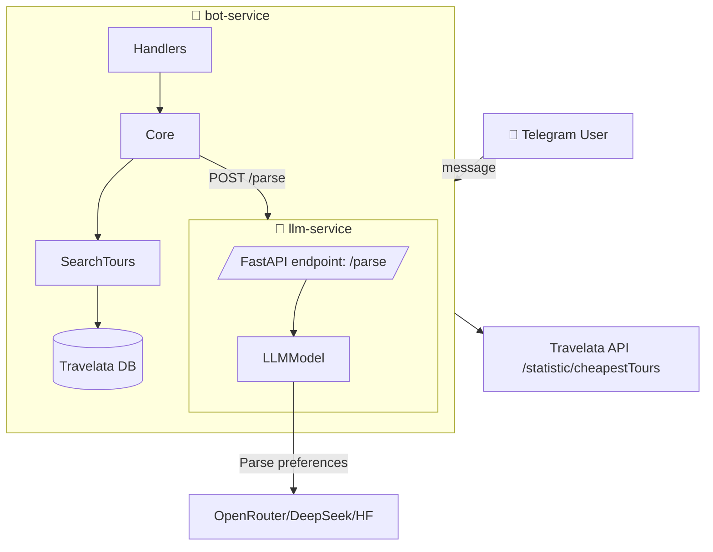

# 🌍 AI Travel Assistant Bot

🤖 **AI Travel Assistant** is a Telegram bot that helps users find the best travel deals.  
It combines **LLM (LLM-service)** for natural language understanding + **Travelata API** for real tours + **RAG-powered semantic search** to handle flexible user preferences like *“first beach line with bar by the sea”*.  

---

## ✨ Features

- 🔎 **Natural Language Input**  
  Users just type:  
  *“I want to go to Turkey in July from Moscow, 7–10 nights, budget 1200 €, first line with a beach bar”*  

- 🧠 **LLM-powered Understanding**  
  JSON structure extraction with [LLM Service](llm_service/):  
  ```json
  {
    "country": "Turkey",
    "month": "July",
    "duration_days": 7,
    "budget_eur": 1200,
    "adults": 2,
    "preferences": ["first beach line", "bar by the sea"]
  }
  ```

- 🗂️ **Travelata API Integration**  
  Real tours loaded into SQLite from `Travelata` (countries, cities, resorts, hotels, categories, meals).

- ⚡ **Hybrid Search**  
  - **SQL filters** → country, dates, budget, nights  
  - **Semantic RAG reranking** → preferences matched via `sentence-transformers`.

- 🎯 **Telegram Bot**  
  Easy interaction with a friendly chat interface.

---

## 🏗️ Architecture



- `bot_service/` → Telegram + business logic  
- `llm_service/` → JSON parser over LLM API (OpenRouter/DeepSeek/HuggingFace)  
- `search_tours/` → SQL + RAG search  
- `data/` + SQLite → cached Travelata tours & dictionaries  

---

## 🛠️ Tech Stack

- **LLM**: OpenRouter / DeepSeek / HuggingFace (Sentence Transformers for embeddings)  
- **Bot**: [python-telegram-bot](https://github.com/python-telegram-bot/python-telegram-bot)  
- **DB**: SQLite + FAISS (RAG search)  
- **API Integration**: Travelata API (tours, countries, meals, hotel categories)  
- **Services**: Docker Compose microservices (`bot-service`, `llm-service`)  
- **Deployment**: Docker  

---

## 🚀 Getting Started

### 1. Clone repo
```bash
git clone https://github.com/your-username/travel-bot.git
cd travel-bot
```

### 2. Prepare `config.yaml`
```yaml
telegram:
  token: "YOUR_TELEGRAM_BOT_TOKEN"

travelata:
  base_url: "https://api-gateway.travelata.ru"
  token: "YOUR_TRAVELATA_PARTNER_TOKEN"
  auth_mode: "Token"

database:
  path: "data/travelata.db"

llm_service:
  url: "http://llm-service:8001/parse"
```

### 3. Run migrations
```bash
python init_db.py   # creates data/travelata.db with tables
```

### 4. Build services
```bash
docker-compose up --build
```

---

## 💬 Usage

1. Open your bot in Telegram (`@YourBotName`)  
2. Send a message like:  

```
I want to go to Egypt in February, 10 nights, All Inclusive, 1000€, from Moscow
```

3. Bot replies with tours:  

```
🔥 Found 3 tours:

🏨 Hilton Hurghada Plaza (10 nights)
💰 98,000 RUB
📅 Check-in: 2025-02-05
🔗 travelata.ru/hotel/...

...
```

---

## 🔍 Search Logic (ML)

1. **Structured SQL filtering**:  
   ```
   country_id=162, nights=7–12, budget<=1200€
   ```
2. **RAG reranking**: semantic similarity via `paraphrase-multilingual-MiniLM-L12-v2`  
   ```python
   util.cos_sim(embedding(preferences), embedding(hotel_features))
   ```
3. Top‑N results → sent to Telegram.

---

## 📂 Project Structure

```
travel_bot/
├── bot_service/         # Telegram bot logic
│   ├── core.py
│   ├── handlers.py
│   ├── main.py
│   └── search_tours.py
├── llm_service/         # LLM (FastAPI service)
│   ├── main.py
├── utils/               # helpers (config loader etc.)
├── data/                # SQLite DB + migrations
│   ├── migrations.sql
│   └── loader.py
├── docker-compose.yaml
├── config.yaml
└── README.md
```

---

## 🎯 TODO / Roadmap

- [ ] Add fallback: reload Travelata tours if DB misses results  
- [ ] Improve preferences → map to categorical filters (meals, hotel stars)  
- [ ] Frontend: Web UI (Streamlit/React)  
- [ ] Add multi-user session context  
- [ ] Deploy to cloud (Railway/Render + scalable DB)  

---

## 🤝 Contributing

Pull requests and issues are welcome!  
You can:  
- Add more travel APIs (Booking, Aviasales, Expedia)  
- Improve RAG embeddings (try `e5-large-v2`, `bge-m3`)  
- Enhance formatting for Telegram replies  

---

## 📜 License

MIT License. Free for personal and commercial use.  

---
